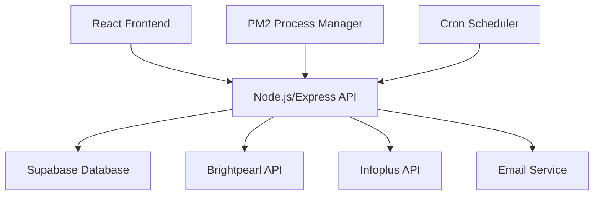

# 📦 Texon Inventory Comparison System

> **Automated inventory synchronization and discrepancy detection between Brightpearl and Infoplus systems**

[](https://github.com/rynoceris/texon-inventory-comparison)
[]()
[]()
[]()

## 🎯 Overview

The **Texon Inventory Comparison System** is a production-ready web application that automatically compares inventory levels between **Brightpearl** and **Infoplus** systems, providing real-time discrepancy detection, automated reporting, and comprehensive inventory management workflows.

### ✨ Key Benefits
- 🔄 **Automated Daily Comparisons** - Eliminates 95% of manual inventory checking
- 📧 **Smart Email Notifications** - Instant alerts with detailed Excel reports
- 📊 **Advanced Analytics** - Historical trends and statistical analysis
- 🛡️ **Enterprise Security** - JWT authentication with Row Level Security
- ⚡ **Real-time Processing** - Live inventory synchronization and monitoring

---

## 🚀 Features

### **Core Functionality**
| Feature | Description |
|---------|-------------|
| 🔄 **Dual API Integration** | Seamless connections to Brightpearl and Infoplus APIs |
| 🎯 **Smart SKU Matching** | Advanced normalization with fuzzy matching algorithms |
| 📊 **Excel Reporting** | Professional multi-sheet reports with statistics |
| 📧 **Email Automation** | Scheduled notifications with Excel attachments |
| ⏰ **Cron Scheduling** | Automated daily comparisons with timezone support |
| 👥 **User Management** | Complete admin interface with role-based access |

### **Advanced Capabilities**
- **Intelligent SKU Normalization** - Handles case differences, separators, and variations
- **Statistical Analysis** - Comprehensive metrics and trend identification  
- **Historical Tracking** - Complete audit trail of all inventory comparisons
- **Configurable Alerts** - Threshold-based notifications and escalation
- **Performance Monitoring** - Real-time system health and API status
- **Data Export** - Multiple formats for external analysis and reporting

---

## 🏗️ Architecture



### **Technology Stack**
- **Backend**: Node.js, Express.js, JWT Authentication
- **Frontend**: React.js, Responsive Design
- **Database**: Supabase (PostgreSQL) with Row Level Security
- **APIs**: Brightpearl, Infoplus WMS Integration
- **Email**: Nodemailer with SMTP
- **Reports**: ExcelJS for professional formatting
- **Deployment**: PM2 Process Management

---

## 📋 Prerequisites

### **System Requirements**
- **Node.js** 16.x or higher
- **npm** or **yarn** package manager
- **512MB+ RAM** (1GB+ recommended for production)
- **Stable internet connection** for API access

### **External Services**
- **Supabase Account** - For database and authentication
- **Brightpearl API Access** - Valid account and credentials
- **Infoplus WMS Access** - API key and LOB configuration
- **SMTP Email Service** - For automated notifications

---

## 🚀 Quick Start

### 1. **Clone Repository**
```bash
git clone https://github.com/rynoceris/texon-inventory-comparison.git
cd texon-inventory-comparison
```

### 2. **Install Dependencies**
```bash
npm install
```

### 3. **Environment Configuration**
Create `.env` file in project root:
```env
# Database Configuration
SUPABASE_URL=your_supabase_project_url
SUPABASE_ANON_KEY=your_supabase_anon_key
SUPABASE_SERVICE_KEY=your_supabase_service_key

# API Configurations
BRIGHTPEARL_ACCOUNT=your_brightpearl_account
BRIGHTPEARL_APP_REF=your_app_reference
BRIGHTPEARL_TOKEN=your_api_token
INFOPLUS_API_KEY=your_infoplus_api_key

# Email Configuration
SMTP_HOST=your_smtp_server
SMTP_PORT=587
SMTP_USER=your_email_address
SMTP_PASS=your_email_password
SMTP_FROM=noreply@yourdomain.com

# Application Settings
PORT=3001
JWT_SECRET=your_jwt_secret_key
```

### 4. **Database Setup**
```bash
# Run database schema setup in Supabase SQL editor
# Execute: scripts/setup-database.sql

# Create initial admin user
node scripts/setup-admin.js [username] [password] [email]
```

### 5. **Build Frontend**
```bash
cd client
npm install
npm run build
cd ..
```

### 6. **Start Application**
```bash
# Development
npm run dev

# Production with PM2
npm install -g pm2
pm2 start ecosystem.config.js
```

### 7. **Access Application**
Open browser to: `http://localhost:3001/texon-inventory-comparison`

**Default Login**: `admin` / `changeme123`

---

## 📖 Usage Guide

### **Dashboard Navigation**
1. **📊 Dashboard** - System overview and real-time status
2. **⚙️ Settings** - Configuration management
3. **📋 Reports** - Historical report browser
4. **👥 Users** - User management (Admin only)

### **Running Comparisons**
- **Manual**: Click "Run Manual Comparison" on dashboard
- **Scheduled**: Configure cron schedule in Settings → Scheduled Comparisons
- **Email**: Reports automatically sent to configured recipients

### **Configuration Options**
| Setting | Description | Default |
|---------|-------------|---------|
| **Email Recipients** | Comma-separated email addresses | admin@texontowel.com |
| **Cron Schedule** | Daily comparison time (cron format) | 0 19 * * * (7 PM) |
| **Report Retention** | Days to keep historical reports | 30 days |
| **Email Threshold** | Max discrepancies in email body | 25 items |
| **API Timeout** | Request timeout in seconds | 60 seconds |

---

## 📊 Sample Reports

### **Excel Report Contents**
1. **📋 Report Summary**
   - Total discrepancies count
   - Brightpearl and Infoplus item counts
   - Generation timestamp

2. **⚠️ Discrepancies Sheet**
   - SKU-by-SKU comparison
   - Stock levels and differences
   - Product names and brands
   - Color-coded variations

3. **📈 Statistics Sheet**
   - Positive/negative discrepancy breakdown
   - Average and maximum differences
   - Trend analysis data

### **Email Notifications**
- **📧 Subject**: `Texon Inventory Comparison Report - [Date] ([X] discrepancies)`
- **📋 Body**: Summary with top discrepancies table
- **📎 Attachment**: Complete Excel report with all sheets

---

## 🔧 API Endpoints

### **Authentication**
```http
POST /texon-inventory-comparison/api/auth/login
Content-Type: application/json

{
  "username": "admin",
  "password": "your_password"
}
```

### **System Health**
```http
GET /texon-inventory-comparison/api/health
```

### **Manual Comparison**
```http
POST /texon-inventory-comparison/api/run-comparison
Authorization: Bearer your_jwt_token
```

### **Reports**
```http
# Get all reports
GET /texon-inventory-comparison/api/reports
Authorization: Bearer your_jwt_token

# Get latest report
GET /texon-inventory-comparison/api/latest-report
Authorization: Bearer your_jwt_token

# Download report Excel
GET /texon-inventory-comparison/api/reports/:id/download
Authorization: Bearer your_jwt_token
```

---

## ⚙️ Configuration

### **System Settings**
All settings are configurable through the web interface:

- **🔔 Email Notifications** - Enable/disable automated emails
- **⏰ Cron Scheduling** - Set comparison frequency and timing  
- **🗂️ Report Management** - Configure retention and cleanup
- **🔧 Performance Tuning** - API timeouts and concurrency
- **🐛 Debug Logging** - Detailed system diagnostics

### **PM2 Configuration**
Production deployment with process management:
```javascript
// ecosystem.config.js
module.exports = {
  apps: [{
    name: 'texon-inventory-comparison',
    script: 'server.js',
    instances: 1,
    exec_mode: 'fork',
    env: {
      NODE_ENV: 'production',
      PORT: 3001
    }
  }]
}
```

---

## 🛡️ Security Features

### **Authentication & Authorization**
- **JWT Tokens** - Secure session management
- **Password Hashing** - bcrypt encryption
- **Row Level Security** - Database-level access control
- **Service Keys** - Privileged database operations

### **Data Protection**
- **Environment Variables** - Sensitive data isolation
- **API Rate Limiting** - Request throttling protection
- **Input Validation** - SQL injection prevention
- **Error Handling** - Information disclosure protection

---

## 📈 Monitoring & Troubleshooting

### **Health Monitoring**
```bash
# PM2 Status
pm2 status

# Application Logs
pm2 logs texon-inventory-comparison

# System Resources
pm2 monit
```

### **Common Issues**
| Issue | Solution |
|-------|----------|
| **API Connection Errors** | Verify credentials and network connectivity |
| **Email Delivery Issues** | Check SMTP configuration and firewall |
| **Database Errors** | Validate Supabase connection and permissions |
| **Performance Issues** | Adjust API timeout and concurrency settings |

### **Debug Mode**
Enable detailed logging in Settings → System Performance → Debug Logging

---

## 📊 Performance Metrics

### **Typical Performance**
- **API Response Time**: < 2 seconds per system
- **Report Generation**: < 30 seconds for 2500+ SKUs
- **Memory Usage**: ~100MB stable operation
- **Database Size**: ~1MB per daily report

### **Scalability**
- **SKU Capacity**: Tested with 2500+ products
- **Concurrent Users**: Supports 10+ simultaneous users
- **Report History**: Unlimited with configurable retention
- **API Rate Limits**: Intelligent throttling and queuing

---

## 🤝 Contributing

### **Development Setup**
```bash
# Clone repository
git clone https://github.com/rynoceris/texon-inventory-comparison.git

# Install dependencies
npm install
cd client && npm install && cd ..

# Start development mode
npm run dev
```

### **Code Standards**
- **ES6+** JavaScript syntax
- **React Hooks** for frontend components
- **Express.js** RESTful API design
- **Comprehensive** error handling
- **Security** best practices

---

## 📄 License

This project is proprietary software owned by **Texon Towel Company**. All rights reserved.

---

## 🆘 Support

### **Documentation**
- **📋 Release Notes** - See `RELEASE_NOTES.md` for version history
- **🔧 API Reference** - Complete endpoint documentation
- **⚙️ Configuration Guide** - Detailed setup instructions

### **Getting Help**
- **🐛 Issues** - Report bugs via GitHub Issues
- **💡 Feature Requests** - Suggest improvements
- **📧 Technical Support** - Contact system administrator

---

## 🎯 Business Impact

### **Operational Benefits**
- **⏱️ Time Savings** - 95% reduction in manual inventory checking
- **✅ Accuracy Improvement** - Real-time discrepancy detection
- **📋 Audit Compliance** - Complete historical documentation
- **💰 Cost Reduction** - Automated workflows eliminate manual processes

### **Key Metrics**
- **Daily Processing** - 2500+ SKU comparisons in under 30 seconds
- **Error Detection** - Instant identification of inventory mismatches  
- **Report Generation** - Professional Excel reports with statistics
- **Email Automation** - Zero-touch notification delivery

---

<div align="center">

**Built with ❤️ for efficient inventory management**

[]()
[]()
[]()
[]()

*Streamlining inventory operations through intelligent automation*

</div>