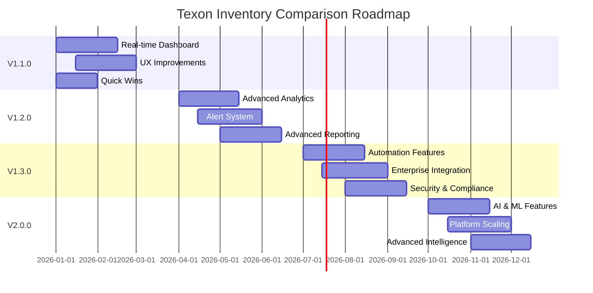

# 🗺️ Texon Inventory Comparison - Product Roadmap

> **Transforming from solid inventory comparison tool into a comprehensive inventory intelligence platform**

---

## 🎯 **Vision Statement**

Our goal is to evolve the Texon Inventory Comparison System from an effective inventory synchronization tool into a comprehensive **Inventory Intelligence Platform** that provides predictive analytics, automated reconciliation, and enterprise-grade operational insights.

---

## 📋 **Release Planning Overview**

| Version | Timeline | Focus Area | Status |
|---------|----------|------------|--------|
| **v1.0.0** | ✅ **Complete** | Core functionality & production stability | 🟢 Released |
| **v1.1.0** | 🎯 **Q1 2026** | Real-time dashboard & user experience | 📋 Planned |
| **v1.2.0** | 🔮 **Q2 2026** | Advanced analytics & intelligence | 🔮 Future |
| **v1.3.0** | 🔮 **Q3 2026** | Enterprise integrations & automation | 🔮 Future |
| **v2.0.0** | 🔮 **Q4 2026** | AI-powered insights & predictions | 🔮 Vision |

---

## 🚀 **Version 1.1.0 - Enhanced User Experience**
*Target: Q1 2026*

### 🎯 **Priority Features**

#### **1. Real-time Dashboard & Analytics**
- **🎯 High Priority**
- 📊 **Live inventory discrepancy counter** on dashboard
- 📈 **Historical trend charts** showing discrepancy patterns over time
- 🔄 **Real-time sync status** indicators for both APIs
- ⚡ **Performance metrics dashboard** (API response times, success rates)

#### **2. Improved User Experience**
- **🎯 High Priority**
- 📱 **Mobile-responsive design** improvements
- ⚡ **Advanced filtering** (by SKU pattern, date range, discrepancy size)
- 🔍 **Search functionality** across all reports
- 📊 **Export options** (CSV, PDF reports)
- ⭐ **Favorite/bookmark** frequently viewed reports

#### **3. Quick Wins & Polish**
- **✅ Low Effort, High Impact**
- ⌨️ **Keyboard shortcuts** for common actions
- 🔄 **Auto-refresh** for live data
- 🌙 **Dark mode** support
- 🕒 **Data export timestamps**
- 📡 **System uptime** indicator

### 📊 **Success Metrics**
- **User Engagement**: 40% increase in daily active usage
- **Performance**: <2 second page load times
- **Mobile Usage**: Support for 90% of mobile devices
- **User Satisfaction**: 4.5+ star rating from internal users

---

## 🔮 **Version 1.2.0 - Advanced Intelligence**
*Target: Q2 2026*

### 🧠 **Enhanced Inventory Intelligence**
- **🎯 High Priority**
- 🔗 **SKU mapping suggestions** for unmatched items
- 📊 **Discrepancy pattern analysis** (which SKUs consistently have issues)
- 📅 **Seasonal trend detection**
- 💰 **Cost impact calculation** (discrepancy value in dollars)
- 📈 **ABC analysis integration** (focus on high-value items)

### 🚨 **Advanced Alerting & Notifications**
- **🎯 Medium Priority**
- 📏 **Threshold-based alerts** (e.g., alert if discrepancies exceed 50 items)
- 💬 **Slack/Teams integration** for instant notifications
- 📱 **SMS alerts** for critical discrepancies
- 🔗 **Webhook support** for custom integrations
- 📈 **Alert escalation** (notify managers if discrepancies persist)

### 📈 **Advanced Reporting**
- **🎯 Medium Priority**
- 📝 **Custom report templates**
- ⏰ **Scheduled report generation** (weekly/monthly summaries)
- 👔 **Executive dashboards** with KPIs
- 📊 **Variance analysis** reports
- 🔍 **Root cause analysis** suggestions
- 📈 **Comparison reports** (month-over-month, year-over-year)

### 📊 **Success Metrics**
- **Automation**: 60% reduction in manual SKU mapping time
- **Alert Accuracy**: <5% false positive rate
- **Cost Savings**: Track $50K+ in prevented inventory discrepancies
- **Reporting Efficiency**: 80% faster executive report generation

---

## 🔮 **Version 1.3.0 - Enterprise Automation**
*Target: Q3 2026*

### 🤖 **Operational Efficiency**
- **🎯 High Priority**
- 🤝 **Automated reconciliation** suggestions
- 🏭 **Integration with warehouse management** for automatic adjustments
- 📦 **Batch processing** for large inventory updates
- 🔄 **API rate limiting** with intelligent queuing
- 💾 **Cached inventory data** to reduce API calls
- 🔄 **Background sync** with progress indicators

### 🔗 **Integration Capabilities**
- **🎯 High Priority**
- 🔌 **REST API** for external systems
- ⚡ **Zapier integration** for workflow automation
- 🏢 **ERP system connectors** (SAP, NetSuite, etc.)
- 📊 **Business Intelligence** tool integration
- 📈 **Inventory forecasting** system connections

### 🛡️ **Security & Compliance**
- **🎯 Medium Priority**
- 📋 **Audit trail** for all user actions
- 👥 **Role-based permissions** (viewer, operator, admin)
- 🔑 **API key rotation** management
- 🗂️ **Data retention policies** with automatic archival
- 💾 **Backup verification** and disaster recovery
- 🔒 **GDPR compliance** features

### 📊 **Success Metrics**
- **Automation**: 80% of reconciliation actions automated
- **Integration**: 3+ external system connections
- **Compliance**: 100% audit trail coverage
- **API Usage**: Support 10,000+ API calls/day

---

## 🔮 **Version 2.0.0 - AI-Powered Intelligence**
*Target: Q4 2026*

### 🤖 **Performance & Scalability**
- **🎯 High Priority**
- 🏎️ **Database query optimization**
- 💾 **Caching layer** for frequently accessed data
- ⚖️ **Load balancing** for high availability
- 🔄 **Background job processing** for heavy operations
- 🗜️ **API response compression**

### 🤝 **User Support Features**
- **🎯 Medium Priority**
- ❓ **In-app help system** and tooltips
- 🚀 **User onboarding** workflow
- 🏥 **System health checks** with diagnostics
- 🔧 **Error recovery** suggestions
- 📊 **Activity logging** for troubleshooting

### 🤖 **AI & Machine Learning**
- **🔮 Future Vision**
- 🧠 **Predictive analytics** for inventory trends
- 🤖 **Automated anomaly detection**
- 📊 **Intelligent forecasting** models
- 🎯 **Smart recommendations** engine
- 📈 **Predictive maintenance** for inventory systems

### 📊 **Success Metrics**
- **Performance**: Support 100,000+ SKUs
- **Scalability**: Handle 100+ concurrent users
- **AI Accuracy**: 95%+ prediction accuracy
- **User Adoption**: 90% feature utilization rate

---

## 🎯 **Priority Matrix**

### **🔥 High Priority - Immediate Impact**
1. **Real-time Dashboard** - Most immediate value for daily operations
2. **Advanced Alerting** - Proactive issue detection and response  
3. **SKU Mapping Intelligence** - Reduce manual reconciliation work

### **📈 Medium Priority - Strategic Value**
1. **Advanced Reporting** - Executive insights and analytics
2. **Enterprise Integrations** - Workflow automation
3. **Security Enhancements** - Compliance and governance

### **🔮 Future Vision - Innovation**
1. **AI-Powered Insights** - Predictive analytics
2. **Advanced Automation** - Self-healing systems
3. **Platform Expansion** - Multi-tenant architecture

---

## 💡 **Quick Wins Implementation**

### **Phase 1: Immediate (1-2 weeks)**
- ✅ **Keyboard shortcuts** for common actions
- ✅ **Auto-refresh** for live data  
- ✅ **Dark mode** support
- ✅ **Data export timestamps**
- ✅ **System uptime** indicator

### **Phase 2: Short-term (1 month)**
- 📱 **Mobile responsiveness** improvements
- 🔍 **Basic search** functionality
- 📊 **CSV export** options
- ⚡ **Performance** optimizations

### **Phase 3: Medium-term (3 months)**
- 📈 **Historical trend** charts
- 🚨 **Basic alerting** system
- 🔄 **API caching** implementation
- 👥 **User role** management

---

## 📊 **Technical Debt & Improvements**

### **Code Quality**
- 🧪 **Unit test coverage** to 80%+
- 📝 **API documentation** with OpenAPI/Swagger
- 🔍 **Code review** process implementation
- 🏗️ **Refactoring** legacy components

### **Infrastructure**
- 🔄 **CI/CD pipeline** setup
- 📊 **Monitoring** and alerting
- 💾 **Database** optimization
- 🔒 **Security** hardening

### **Documentation**
- 📖 **User guides** and tutorials
- 🔧 **Admin documentation**
- 🎓 **Developer onboarding**
- 📹 **Video tutorials**

---

## 🤝 **Community & Feedback**

### **Feedback Channels**
- 📧 **User interviews** and surveys
- 📊 **Usage analytics** and metrics
- 🐛 **Bug reports** and feature requests
- 💡 **Innovation workshops**

### **Success Measurement**
- 📈 **User adoption** rates
- ⚡ **System performance** metrics
- 💰 **Business impact** measurement
- 😊 **User satisfaction** scores

---

## 📅 **Milestone Timeline**

---

## 🎯 **Getting Involved**

### **For Stakeholders**
- 📋 **Priority feedback** on proposed features
- 💼 **Business case** validation
- 🎯 **Success criteria** definition
- 📊 **ROI measurement** collaboration

### **For Developers**
- 🔨 **Feature implementation** planning
- 🧪 **Technical feasibility** assessment
- 🏗️ **Architecture** design reviews
- 📝 **Documentation** contributions

### **For Users**
- 🧪 **Beta testing** participation
- 💡 **Feature suggestions** and feedback
- 📚 **Documentation** review and input
- 🎓 **Training** and adoption support

---

**🚀 Building the Future of Inventory Intelligence**

*From automation to intelligence, one release at a time*

